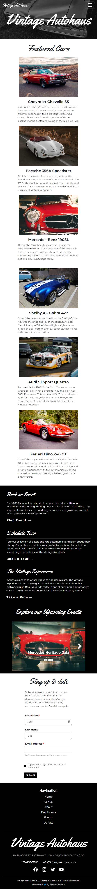

 

  

  <h3 align="center">Vintage Autohaus</h3>

  

    A website for a Vintage Car Museum.
     
    <a href="https://afrokk.github.io/Vintage-Autohaus/"><strong>Check it out! »</strong></a>
     
  

## About The Project

A fully responsive, scalable website for an Automotive Museum for Vintage Cars. Built using HTML, CSS, Bootstrap 5, and some JavaScript. Compatible with the biggest of devices to the smallest ones. Based on a monochrome color scheme with colors sprinkled in, the website gives the perfect vintage vibe to represent the Vintage Autohaus museum.

## Built With

Utilized SASS for CSS compiling, bundling and optimizations, jQuery for some animations and Bootstrap 5 for a lot of the design.

* [![Bootstrap][Bootstrap.com]][Bootstrap-url]
* [![HTML][html.com]][html-url]
* [![jQuery][jQuery.com]][jQuery-url]
* [![SASS][SASS.com]][SASS-url]
* [![CSS][CSS.com]][CSS-url]

## Design
Here's a look at the design of the website on different devices.

### Desktop Version

  

### Mobile Version

  

### Tablet Version

  

(<a href="#readme-top">back to top</a>)

## To-Do
Some of the things I'd like to do with this project, as I work on it:

- [x] Complete Home Page.
- [x] Optimize.
- [ ] Complete About Page.
- [ ] Complete Tickets Page.
- [ ] Complete Venue Page.
- [ ] Complete Tickets Page.

## Contact

Afrasiyab (Afrokk) Khan - [@afrokk_](https://www.instagram.com/afrokk_/) - [afrokk.design](https://afrokk.design/home) - [LinkedIn](https://www.linkedin.com/in/afrasiyab-k/) - afrasiyabkhan379@gmail.com

Project Link: [https://github.com/Afrokk/Vintage-Autohaus](https://github.com/Afrokk/Vintage-Autohaus)

[product-screenshot]: images/logo.png
[Bootstrap.com]: https://img.shields.io/badge/Bootstrap-563D7C?style=for-the-badge&logo=bootstrap&logoColor=white
[Bootstrap-url]: https://getbootstrap.com
[html.com]: https://img.shields.io/static/v1?style=for-the-badge&message=HTML5&color=E34F26&logo=HTML5&logoColor=FFFFFF&label=
[html-url]: https://en.wikipedia.org/wiki/HTML
[SASS.com]: https://img.shields.io/static/v1?style=for-the-badge&message=Sass&color=CC6699&logo=Sass&logoColor=FFFFFF&label=
[SASS-url]: https://sass-lang.com/
[CSS.com]: https://img.shields.io/static/v1?style=for-the-badge&message=CSS3&color=1572B6&logo=CSS3&logoColor=FFFFFF&label=
[CSS-url]: https://developer.mozilla.org/en-US/docs/Web/CSS
[jQuery.com]: https://img.shields.io/static/v1?style=for-the-badge&message=jQuery&color=0769AD&logo=jQuery&logoColor=FFFFFF&label=
[jQuery-url]: https://jquery.com/
