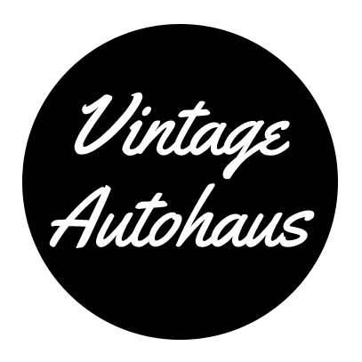

 

  

  <h3 align="center">Vintage Autohaus</h3>

  

    A website design for a Vintage Car Museum.
     
    <a href="https://afrokk.github.io/Vintage-Autohaus/" target="_blank"><strong>Check it out Live! »</strong></a>
     
  

## About The Project

A fully responsive, scalable website built from scratch for an Automotive Museum for Vintage Cars. Built using HTML, CSS, SASS, Bootstrap 5, and JavaScript. Compatible with the biggest of devices to the smallest ones. Based on a monochrome color scheme with colors sprinkled in, the website gives the perfect vintage vibe to represent the Vintage Autohaus museum.

## Features

* Fully web optimized, for fast load times.
* Fully scalable code. Can be coupled with a back-end and a database in the future.
* Bundled styles using the SASS compiler. This helps with performance.
* Reused elements and styles along with certain components (Like buttons & forms).
* Custom style files for individual pages. 
* Utilized JavaScript to generate repetitive HTML code.
* Supports all devices, fully responsive.

## Built With

Utilized SASS for CSS compiling, bundling and optimizations, jQuery for some animations and Bootstrap 5 for a lot of the design.

* [![jQuery][jQuery.com]][jQuery-url]
* [![JavaScript][JavaScript.com]][JavaScript-url]
* [![SASS][SASS.com]][SASS-url]
* [![CSS][CSS.com]][CSS-url]
* [![Bootstrap][Bootstrap.com]][Bootstrap-url]
* [![HTML][html.com]][html-url]

## Design
Here's a look at the design of the website on different devices.

### Desktop Version

View Desktop Version

  

### Mobile Version

View Mobile Version

  

### Venue Page

View Venue Page

  

### Tickets Page

View Tickets Page

  

### About Page

View About Page

## View it LIVE by clicking <a href="">here</a>.

  

## To-Do
Some of the things I'd like to do with this project, as I work on it:

- [x] Complete Home Page.
- [x] Complete About Page. 
- [x] Complete Tickets Page.
- [x] Complete Venue Page. 
- [ ] Optimize. (In Progress)

## Contact

Afrasiyab (Afrokk) Khan - [@afrokk_](https://www.instagram.com/afrokk_/) - [afrokk.design](https://afrokk.design/) - [afrokk.dev](https://afrokk.dev/) - [LinkedIn](https://www.linkedin.com/in/afrasiyab-k/) - afrasiyabkhan379@gmail.com

Project Link: [https://github.com/Afrokk/Vintage-Autohaus](https://github.com/Afrokk/Vintage-Autohaus)

[product-screenshot]: images/logo.png
[Bootstrap.com]: https://img.shields.io/badge/Bootstrap-563D7C?style=for-the-badge&logo=bootstrap&logoColor=white
[Bootstrap-url]: https://getbootstrap.com
[html.com]: https://img.shields.io/static/v1?style=for-the-badge&message=HTML5&color=E34F26&logo=HTML5&logoColor=FFFFFF&label=
[html-url]: https://en.wikipedia.org/wiki/HTML
[SASS.com]: https://img.shields.io/static/v1?style=for-the-badge&message=Sass&color=CC6699&logo=Sass&logoColor=FFFFFF&label=
[SASS-url]: https://sass-lang.com/
[CSS.com]: https://img.shields.io/static/v1?style=for-the-badge&message=CSS3&color=1572B6&logo=CSS3&logoColor=FFFFFF&label=
[CSS-url]: https://developer.mozilla.org/en-US/docs/Web/CSS
[jQuery.com]: https://img.shields.io/static/v1?style=for-the-badge&message=jQuery&color=0769AD&logo=jQuery&logoColor=FFFFFF&label=
[jQuery-url]: https://jquery.com/
[JavaScript.com]: https://img.shields.io/badge/javascript-%23323330.svg?style=for-the-badge&logo=javascript&logoColor=%23F7DF1E
[JavaScript-url]: https://www.javascript.com/
